This is the [fourth course](https://www.coursera.org/learn/convolutional-neural-networks/home/welcome) in the deeplearning.ai courses and covers convulutional neural networks as applied to images.

- [Week 1: Foundations of Convolutional Neural Networks](#week-1-foundations-of-convolutional-neural-networks)
    - [Computer Vision](#computer-vision)
    - [Edge detection example](#edge-detection-example)
    - [Padding](#padding)
    - [Strided convolution](#strided-convolution)
    - [Convolutions over volumes](#convolutions-over-volumes)
    - [One Layer of a Convolutional Network](#one-layer-of-a-convolutional-network)
    - [A simple convolution network example](#a-simple-convolution-network-example)
    - [Pooling layers](#pooling-layers)
    - [Convolutional neural network example](#convolutional-neural-network-example)
    - [Why convolutions?](#why-convolutions)
    - [Yann LeCun interview](#yann-lecun-interview)
- [Week 2: Deep convolutional models: case studies](#week-2-deep-convolutional-models-case-studies)
    - [Why look at case studies?](#why-look-at-case-studies)
    - [Classic Networks](#classic-networks)
    - [ResNets](#resnets)
    - [Networks in Networks and 1x1 Convolutions](#networks-in-networks-and-1x1-convolutions)
    - [Inception Network Motivation](#inception-network-motivation)
    - [Inception Network](#inception-network)
    - [Practical advices for using ConvNets](#practical-advices-for-using-convnets)
        - [Using Open-Source Implementation](#using-open-source-implementation)
        - [Transfer Learning](#transfer-learning)
        - [Data Augmentation](#data-augmentation)
        - [State of Computer Vision](#state-of-computer-vision)
- [Week 3: Object detection](#week-3-object-detection)
    - [Object Localization](#object-localization)
    - [Landmark Detection](#landmark-detection)
    - [Object Detection](#object-detection)
    - [Convolutional Implementation of Sliding Windows](#convolutional-implementation-of-sliding-windows)
    - [Bounding Box Predictions](#bounding-box-predictions)
    - [Intersection Over Union](#intersection-over-union)
    - [Non-max Suppression](#non-max-suppression)
    - [Anchor Boxes](#anchor-boxes)
    - [YOLO Algorithm](#yolo-algorithm)
    - [Region Proposals (R-CNN)](#region-proposals-r-cnn)
- [Week 4: Special applications: Face recognition & Neural style transfer](#week-4-special-applications-face-recognition--neural-style-transfer)
    - [Face Recognition](#face-recognition)
        - [What is face recognition?](#what-is-face-recognition)
    - [Neural Style Transfer](#neural-style-transfer)
        - [](#)

## Week 1: Foundations of Convolutional Neural Networks

> Learn to implement the foundational layers of CNNs (pooling, convolutions) and to stack them properly in a deep network to solve multi-class image classification problems.

### Computer Vision 

- deep learning is advancing all kinds of image applications - art, self driving cars, photo tagging
- some of the computer vision techniques transfer over to other domains, like in speech
- straight forward neural networks choke on large images - a 1000x1000x3 image is 3 million features to input to a fully connected network - if the first hidden layer contains a 1000 units then this just explodes to 3 billion in the first layer alone!
- and this where convulutional networks come in

- some classic CNN networks:
    - LeNet-5
    - AlexNet
    - VGG
- keras makes it easy to [try out pretrained models](https://keras.io/applications/)
- [Fei-Fei Li](https://twitter.com/drfeifei) started the ImageNet picture database, to have real world labelled images to train NN's on. 
    - Hinton won the 2012 Imagenet challange with a CNN deep learning nn, which kickstarted the entire AI revolution as it showed the world that big data made a big difference for deep learning.

### Edge detection example

- different layers detect different features of a image, starting from edges to bigger features
- a convolutional layer uses a filter (also called a kernel) which has a height/depth/width, say 5x5x3 (since images are 3 layers, so are the filters).
- this filter is much smaller than the image generally, starting from the top left corner of the image, we slide this filter across the image (striding 1 or more pixels at a time) - you can see it in action in the gif below, or better yet [read this](https://towardsdatascience.com/applied-deep-learning-part-4-convolutional-neural-networks-584bc134c1e2).


- this shows a 1d convolution, but in practice this would be in 3d.


- different filters allow us to find different kind of things to detect
- we can specify the filters ourselves to detect specific things, or treat them as weights which learn features automatically. this idea is one of the most powerful in computer vision.

### Padding

- depending on the filter and image size, our filter can go over the image as it slides across the image. so we end up loosing information on the edges, and our output image is smaller than it could be.
- padding means we add a number (typically 0) around the imag - there are two types of padding:
    - **valid padding:** the filter window stays inside the actual image data, so the output is smaller than the input. `nxn` image with a `fxf` filter gives us `n-f+1 x n-f+1` output
    - **same padding:** for a stride of 1, pad so the output size is the same as the input size (this requires the filter window to go past the actual image data, hence padding)

- the gif below [from this article](https://medium.freecodecamp.org/an-intuitive-guide-to-convolutional-neural-networks-260c2de0a050) shows stride and padding beautifully:


- filters are usually odd dimensions - 3x3, 5x5 is very common
    - makes it easier to pad
    - there is a central position

### Strided convolution

- the above gif shows us a stride of 1, but we can use any number here. A stride of two just means we move the filter two pixels at a time, which shrinks the output image
- for a `nxn` image with padding `p` and a filter `fxf` and stride `s`, the new image size is: `(n+2p-f)/ s + 1, (n+2p-f)/s + 1`

### Convolutions over volumes

- 2d convulutionals are easy to see, but how does a 3d convolution work?
- filters have height/width/depth, e.g `3x3x3`, where the depth is the same number as the depth of the image. (depth meaning the image channels, typically 3 for RGB)
- a conv filter flattens the image - so we get a 2d output. But since we are detecting multiple things, we can apply multiple filters, and stack the resulting 2d outputs of the different filters.\
- so the depth of the output comes from the number of filters applied to the image

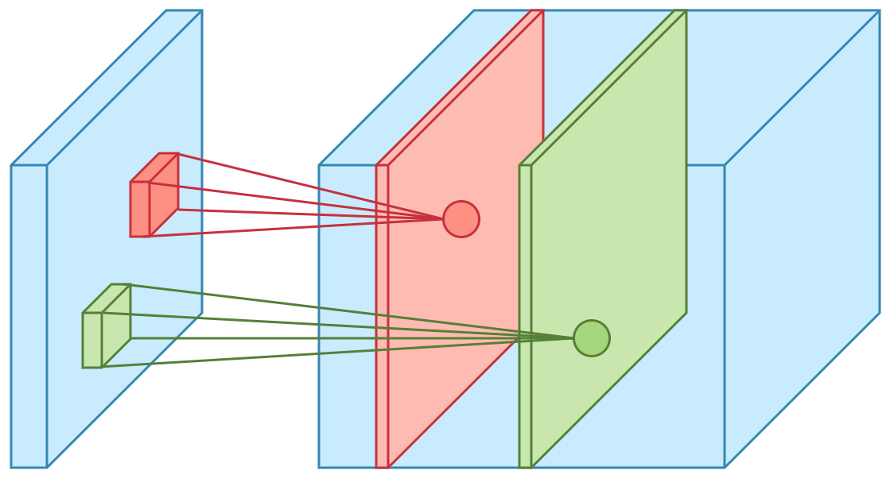

### One Layer of a Convolutional Network

- goes through how to build a single layer
    - apply n filters, add a bias, then a activation (like relu) 
- in practice use a [library like keras](https://keras.io/getting-started/sequential-model-guide/):

```python
# input: 100x100 images with 3 channels -> (100, 100, 3) tensors.
# this applies 32 convolution filters of size 3x3 each.
model.add(Conv2D(32, (3, 3), activation='relu', input_shape=(100, 100, 3)))
```

### A simple convolution network example

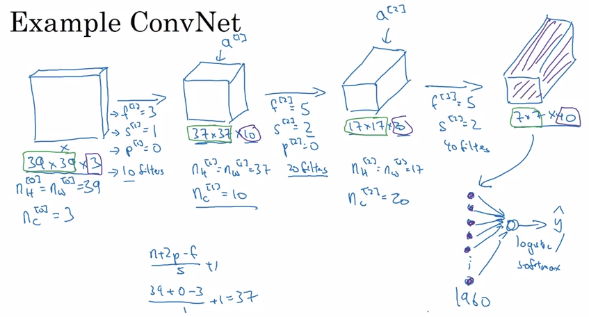

- a typical conv net has three types of layers:
    - convulutional (CONV)
    - pooling (POOL)
    - fully connected (FC)

### Pooling layers

- pooling is a way to reduce the size of our representation
- max pooling uses a filter, commonly 2x2 with stride 2, selects the max value in that region, and makes a new, smaller representation with those max numbers


- hyperparameters: **f**: filter size, **s**: stride, max or average pooling (generally doesn't use padding)
- there are two commonly used types of pooling: max or average pooling

> t is common to periodically insert a Pooling layer in-between successive Conv layers in a ConvNet architecture. Its function is to progressively reduce the spatial size of the representation to reduce the amount of parameters and computation in the network, and hence to also control overfitting. The Pooling Layer operates independently on every depth slice of the input and resizes it spatially, using the MAX operation. The most common form is a pooling layer with filters of size 2x2 applied with a stride of 2 downsamples every depth slice in the input by 2 along both width and height, discarding 75% of the activations. Every MAX operation would in this case be taking a max over 4 numbers (little 2x2 region in some depth slice). The depth dimension remains unchanged.
> 
>  there are only two commonly seen variations of the max pooling layer found in practice: A pooling layer with F=3,S=2 (also called overlapping pooling), and more commonly F=2,S=2 [#](http://cs231n.github.io/convolutional-networks/#architectures)


### Convolutional neural network example

 - builds a simple CNN similar to LeNet-5
 - the cnn:
    - input layer: 32x32x3
    - layer 1: conv (f:5, s:1) --> 28x28x6 + maxpool --> 14x14x6
    - layer 2: con2 --> 10x10x16 + maxpool --> 5x5x16 + flatter --> 400
    - layer 3: fully connected --> 120
    - layer 4: fully connected --> 84
    - layer 5: softmax --> 10

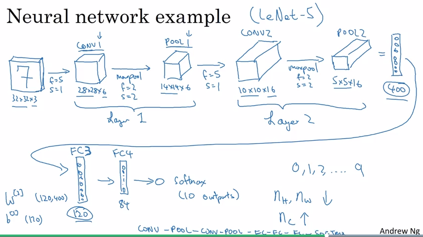

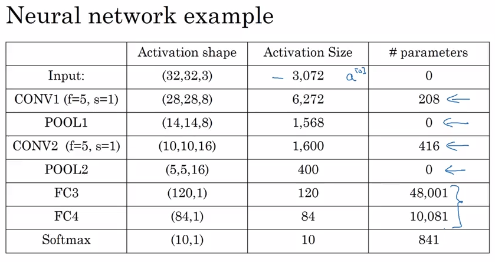

- so this is a basic CNN - a lot of research has gone into figuring this out. some observations:
    - there are a lot of hyperparameters
    - the input size decreases over layers, while number of filters increases
- study working examples of good CNN's to get some intuitions on what works
- generally, do what [Andrej Karpathy suggests](http://cs231n.github.io/convolutional-networks/#architectures):

> In practice: use whatever works best on ImageNet. If you’re feeling a bit of a fatigue in thinking about the architectural decisions, you’ll be pleased to know that in 90% or more of applications you should not have to worry about these. I like to summarize this point as “don’t be a hero”: Instead of rolling your own architecture for a problem, you should look at whatever architecture currently works best on ImageNet, download a pretrained model and finetune it on your data. You should rarely ever have to train a ConvNet from scratch or design one from scratch.

### Why convolutions?

- two main advantages of convolutions are:
    - parameter sharing - a feature detector that is useful in one part is probably also useful in another part of the image
    - sparsity of connections - in each layer, each output value depends only on a small number of inputs, or in another way: bits of the output are only connected to a small part of the input, unlike with fully connected layers where every thing is connected to every thing in the next layer
- study effective architectures - see papers, comps, etc

### Yann LeCun interview

- stumbled onto Chomsky's (language is innate) and Paigets (language is learned) debate b/w nature and nurture - got him interested in ai/neuroscience
- #todo

## Week 2: Deep convolutional models: case studies

> Learn about the practical tricks and methods used in deep CNNs straight from the research papers.

### Why look at case studies?

- a lot of research has gone into how to build the basic building blocks of nn - going over the important research papers and model is the best way to build intuition
- classic CNN networks: LeNet-4, AlexNet, VGG
- current: ResNet, Inception
- some of the ideas in these models apply outside of computer vision

### Classic Networks

- LeNet-5 was published in 1998, implements `Conv ==> Pool ==> Conv ==> Pool ==> FC ==> FC ==> softmax` and used sigmoids and tanh - today we would use relu activations instead

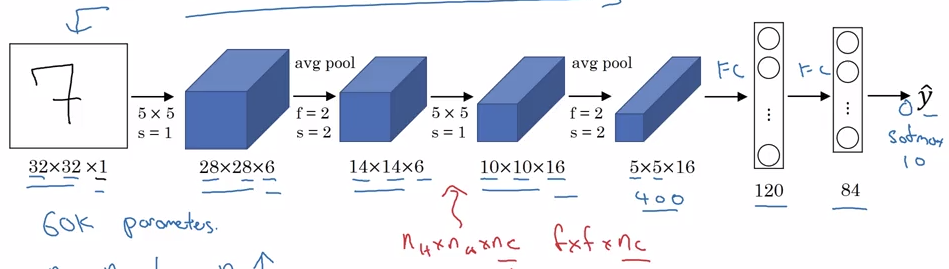

- AlexNet is similar to LeNet but much bigger, 60M vs 60K parameters, and uses relu activation
- used a layer called local response normalization (LRN) but its very useful so skip
- this paper convinced the world that deep learning works 

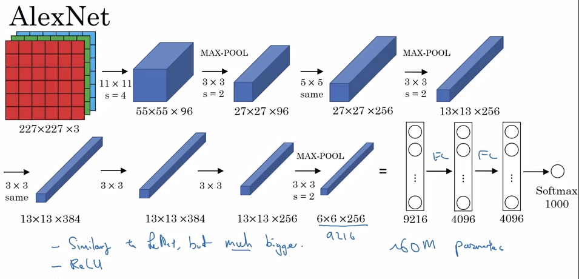

- VGG16 is a deeper network which uses 3x3 convolutions and 2x2 pooling from the beginning to the end, has 138M parameters
- there is a deeper version called VGG-19 but VGG-16 does almost as well
- this paper established that the depth of a network is a critical component

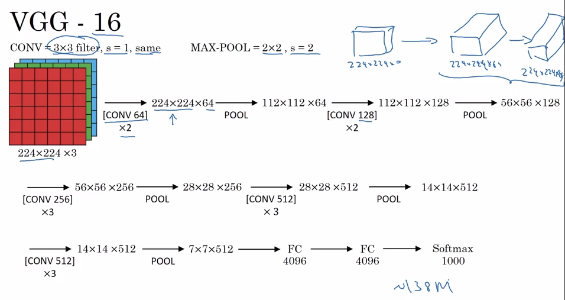

### ResNets

- deep networks suffer from vanishing and exploding gradients
- resnet takes a output from a layer and passes it to a deeper layer, skipping the ones in b/w, allowing us to train a much deeper network

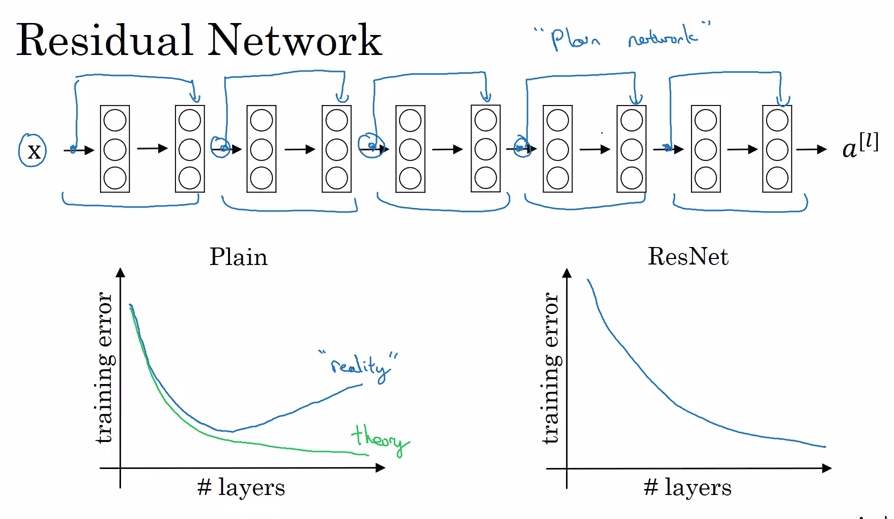

- the pic above shows the skip connections, and that the perf of resnet increases with deeper networks

Why ResNets work


### Networks in Networks and 1x1 Convolutions

- a 1x1 convolution shrinks the channels and applies a non-linerality. If we apply the same number of filters as channels then the output will have the same channels.
- this shrinking helps save a lot of computation as we can shrink channels

### Inception Network Motivation

- when designing a CNN we have to make many choices, like picking a 3x3 or 5x5 Conv, or a max pooling layer, and so on.
- Inception has the brilliant idea of using them all
- downside is that it has huge computation costs, but we can use 1x1 conv layers to reduce computation cost

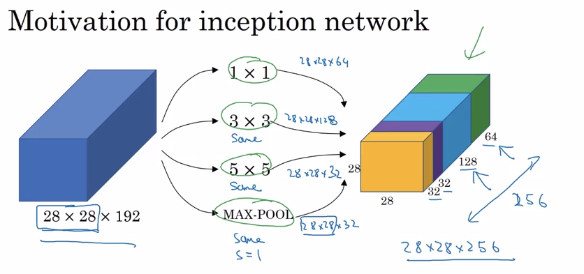


### Inception Network 
 
- developed at Google, see this [article](https://towardsdatascience.com/a-simple-guide-to-the-versions-of-the-inception-network-7fc52b863202)
- inception module:

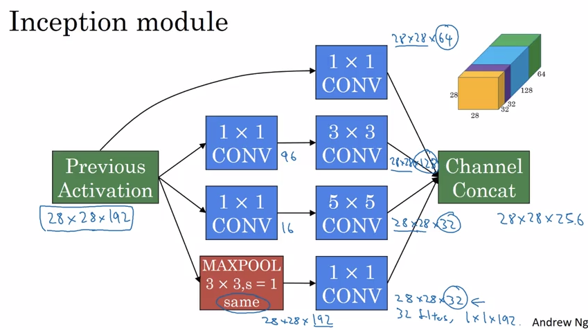

- the inception network has many blocks of the inception module
- there are different versions of inception, including one combined with resnet

### Practical advices for using ConvNets

#### Using Open-Source Implementation

- papers are difficult to replicate, so first look for an open source implementation in github
- most will have pretrained weights available for transfer learning

#### Transfer Learning

- for computer vision its much faster to use pretrained weights for transfer learning, especially since many neural nets need weeks on multiple gpu's to train
- for my own image recognition problem:
    - download a good NN with weigths
    - remove the softmax activation layer and put my own
    - now train the network keeping all the layers frozen except the last one
- if we have a larger data set, we can freeze fewer layers, and train more layers on top 
- another option is to remove the softmax layer, then run the images through the NN and save the output - this is like converting images to a vector representation
- if we have enough data, we can fine tune all the layers in the network 

#### Data Augmentation

- more data equals better deep learning performance
- data augmentation is a easy way to get more image data by changing images in minor ways like mirroring, random cropping, rotation, shearing, local warping, color shifting
- there are many ways to data augment, look at successful open source implementations, like [keras.preprocessing.image.ImageDataGenerator](https://keras.io/preprocessing/image/)
- a common way to implement data augmentation is to have a cpu thread loading/augmenting images and a gpu thread training

#### State of Computer Vision

- computer vision is unique in deep learning
- most machine learning problems fall on a spectrum of little to lots of data
    - small data - we need to hand engineer features, more hacks
    - big data - simple algorithims, less hand engineering
- two sources of knowledge
    - labeled data
    - hand engineered features, network architecture, other components
- there is lots of image data, but its still not enough for complex problems like object detection, so there is lots of hand engineering
- since object detection has limited data, we need complex NNs
- tips for doing well on benchmarks/competions
    - ensembling - train several NNs independently and average their outputs 
        - usually 3-15 networks, improves 1-2%, not worthwhile in production as expensive
    - multi-crop at test time - run classifier on multiple versions of test images and average results
        - again, slows down runtime, Andrew personally doesn't use this in production
    - start with existing open source architectures and weights, fine tune on your dataset


## Week 3: Object detection

> Learn how to apply your knowledge of CNNs to one of the toughest but hottest field of computer vision: Object detection.

### Object Localization

- image classification is looking at a picture and telling us whats in it, like a car
- localization is telling us where the car is in the picture
- we also have multiple objects in a picture
- we change the NN so it outputs a bounding box: bx, by, bh, bw, where (bx, by) is the location of the midpoint of the object, and bh, bw is the height and width
    - the upper left of the image is typically (0,0) and the lower right is (1,1)
- so the training box now contains the class label and these four numbers
- target label y is now a vector: `Pc` (probability there is an object), than `bx by bw bh` then the classes `c1 c2 c3`
- when there is no detected object, `Pc` is zero, and we don't care about the other numbers
- we use logistic regression for `Pc`, log likely hood loss for classes, and squared error for the bounding box.

### Landmark Detection

- sometimes we want landmarks, like the location of eyes on a face, nose etc
- so we can define landmarks in our training set, so the output y predicts the location of the landmarks we care about
- this is the basis of things like snapchats face augmented reality filters etc
- its a simple idea, adding a bunch of output units for the things we care about

### Object Detection

- we train a covnet on closely cropped images of a car - meaning that the image is mainly the car, and it predicts car or not
- then we use this covnet in a sliding windows detection
- sliding windows technique:
    - we slide a window over the image, and feed it to the covnet asking it car or not (we slide the window across the entire image, passing lots of cropped images to the covnet)
    - we now repeat this, using a larger window (and maybe repeat with bigger windows) - the idea there is that if there is a car it will end up in a window
    - store all the windows with a car detected (for overlapping windows, choose the one with better confidence)
- this is infeasible as there is a huge computational cost of sliding windows as we crop heaps of images and run each through a covnet. So we look at a convolutional approach

### Convolutional Implementation of Sliding Windows

- we can turn the FC layer into convolutional layers

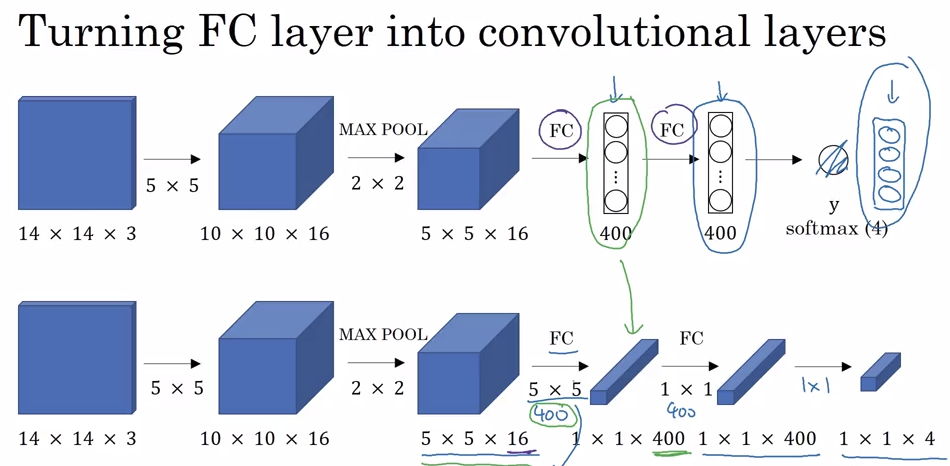

**Convolution implementation of sliding windows:**

- we make all the predictions at the same time instead of one by one
- weakness - the position of the bounding boxes isn't that accurate

### Bounding Box Predictions

- a better algorithim is YOLO - You only look once, from 2015.
- basic idea is that we divide an image with a grid.
    - for a 100x100 image, a 19x19 grid and apply our covnet to each grid cell
- for training labels, each grid cell has a label y as above
- the covnet is applied to each grid position, and returns a image bounding box relative to that box

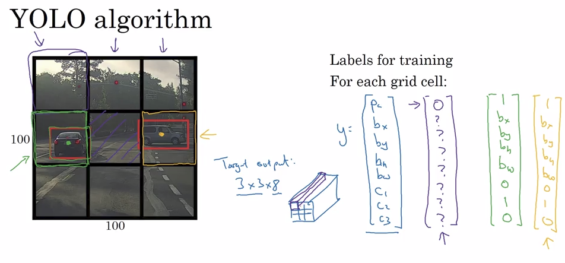

- problem if there is more than one image in a grid cell
- YOLO is hard to understand, so see some simple explanations, like [this guide](https://hackernoon.com/gentle-guide-on-how-yolo-object-localization-works-with-keras-part-1-aec99277f56f)

### Intersection Over Union

- how do we tell if our object detection is working well?
- the intersectoin over union computers the intesection b/w the predicted bounding box and the actual, and computes `IOU = intersection area / Union area` IOU>0.5 is good, higher the better

### Non-max Suppression

- we can detect the same object multiple times as the object can overlap into multiple grid cells=
- so we look at the probabilities of each of the detection, 
- first, discard all boxes with `Pc <= 0.6`
- now take the box with the highest `Pc`, and suppresses the other predictions with a IOU>=0.5 overlap with this one
- so we should be left with only final predictions - this gives us pretty good results

### Anchor Boxes

- detecting objects in a grid cell is a problem - YOLO only detects one object per grid cell
- anchor boxes pre-define the shape of objects
    - before: each object in a training image was assigned to a grid cell which contained that objects midpoint
    - now: each object in a training image is assigned to grid cell that contains the objects midpoint and anchor box for the grid cell with highest IOU.
- choose anchor boxes by hand to cover the variety of shapes we find in our images - or use a KNN algo to choose shapes

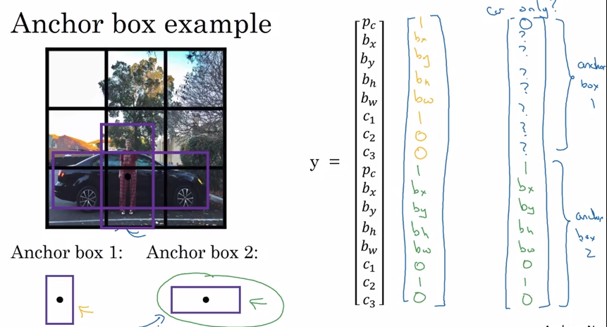 

### YOLO Algorithm

- YOLO is state of the art and pretty accurate
- see [this pretrained model](https://pjreddie.com/darknet/yolo/)

### Region Proposals (R-CNN)

- optional, used less often
- the sliding windows techniques tries to classify a lot of regions in a grid which have no objects
- R-CNN runs a segmentation algo which finds areas of interest and runs a classifier on them
- R-CNN is quite slow, there are improvements like FAST R-CNN but its still slow, so there is a FASTER R-CNN algo too, but its still slower than YOLO
- so this is an interesting idea but

## Week 4: Special applications: Face recognition & Neural style transfer

### Face Recognition

#### What is face recognition?


### Neural Style Transfer

#### 