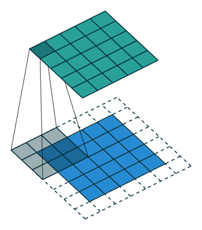

This is the [fourth course](https://www.coursera.org/learn/convolutional-neural-networks/home/welcome) in the deeplearning.ai courses and covers convulutional neural networks as applied to images.

## Week 1: Foundations of Convolutional Neural Networks

> Learn to implement the foundational layers of CNNs (pooling, convolutions) and to stack them properly in a deep network to solve multi-class image classification problems.

### Computer Vision 

- deep learning is advancing all kinds of image applications - art, self driving cars, photo tagging
- some of the computer vision techniques transfer over to other domains, like in speech
- straight forward neural networks choke on large images - a 1000x1000x3 image is 3 million features to input to a fully connected network - if the first hidden layer contains a 1000 units then this just explodes to 3 billion in the first layer alone!
- and this where convulutional networks come in

- some classic CNN networks:
    - LeNet-5
    - AlexNet
    - VGG
- keras makes it easy to [try out pretrained models](https://keras.io/applications/)
- [Fei-Fei Li](https://twitter.com/drfeifei) started the ImageNet picture database, to have real world labelled images to train NN's on. 
    - Hinton won the 2012 Imagenet challange with a CNN deep learning nn, which kickstarted the entire AI revolution as it showed the world that big data made a big difference for deep learning.

### Edge detection example

- different layers detect different features of a image, starting from edges to bigger features
- a convolutional layer uses a filter (also called a kernel) which has a height/depth/width, say 5x5x3 (since images are 3 layers, so are the filters).
- this filter is much smaller than the image generally, starting from the top left corner of the image, we slide this filter across the image (striding 1 or more pixels at a time) - you can see it in action in the gif below, or better yet [read this](https://towardsdatascience.com/applied-deep-learning-part-4-convolutional-neural-networks-584bc134c1e2).


- this shows a 1d convolution, but in practice this would be in 3d.


- different filters allow us to find different kind of things to detect
- we can specify the filters ourselves to detect specific things, or treat them as weights which learn features automatically. this idea is one of the most powerful in computer vision.

### Padding

- depending on the filter and image size, our filter can go over the image as it slides across the image. so we end up loosing information on the edges, and our output image is smaller than it could be.
- padding means we add a number (typically 0) around the imag - there are two types of padding:
    - **valid padding:** the filter window stays inside the actual image data, so the output is smaller than the input. `nxn` image with a `fxf` filter gives us `n-f+1 x n-f+1` output
    - **same padding:** for a stride of 1, pad so the output size is the same as the input size (this requires the filter window to go past the actual image data, hence padding)

- the gif below [from this article](https://medium.freecodecamp.org/an-intuitive-guide-to-convolutional-neural-networks-260c2de0a050) shows stride and padding beautifully:



- filters are usually odd dimensions - 3x3, 5x5 is very common
    - makes it easier to pad
    - there is a central position

### Strided convolution

- the above gif shows us a stride of 1, but we can use any number here. A stride of two just means we move the filter two pixels at a time, which shrinks the output image
- for a `nxn` image with padding `p` and a filter `fxf` and stride `s`, the new image size is: `(n+2p-f)/ s + 1, (n+2p-f)/s + 1`

### Convolutions over volumes

- 2d convulutionals are easy to see, but how does a 3d convolution work?
- filters have height/width/depth, e.g `3x3x3`, where the depth is the same number as the depth of the image. (depth meaning the image channels, typically 3 for RGB)
- a conv filter flattens the image - so we get a 2d output. But since we are detecting multiple things, we can apply multiple filters, and stack the resulting 2d outputs of the different filters.\
- so the depth of the output comes from the number of filters applied to the image


### One Layer of a Convolutional Network

- goes through how to build a single layer
    - apply n filters, add a bias, then a activation (like relu) 
- in practice use a [library like keras](https://keras.io/getting-started/sequential-model-guide/):

```python
# input: 100x100 images with 3 channels -> (100, 100, 3) tensors.
# this applies 32 convolution filters of size 3x3 each.
model.add(Conv2D(32, (3, 3), activation='relu', input_shape=(100, 100, 3)))
```

### A simple convolution network example


- a typical conv net has three types of layers:
    - convulutional (CONV)
    - pooling (POOL)
    - fully connected (FC)

### Pooling layers

- pooling is a way to reduce the size of our representation
- max pooling uses a filter, commonly 2x2 with stride 2, selects the max value in that region, and makes a new, smaller representation with those max numbers


- hyperparameters: **f**: filter size, **s**: stride, max or average pooling (generally doesn't use padding)
- there are two commonly used types of pooling: max or average pooling

> t is common to periodically insert a Pooling layer in-between successive Conv layers in a ConvNet architecture. Its function is to progressively reduce the spatial size of the representation to reduce the amount of parameters and computation in the network, and hence to also control overfitting. The Pooling Layer operates independently on every depth slice of the input and resizes it spatially, using the MAX operation. The most common form is a pooling layer with filters of size 2x2 applied with a stride of 2 downsamples every depth slice in the input by 2 along both width and height, discarding 75% of the activations. Every MAX operation would in this case be taking a max over 4 numbers (little 2x2 region in some depth slice). The depth dimension remains unchanged.
> 
>  there are only two commonly seen variations of the max pooling layer found in practice: A pooling layer with F=3,S=2 (also called overlapping pooling), and more commonly F=2,S=2 [#](http://cs231n.github.io/convolutional-networks/#architectures)


### Convolutional neural network example

 - builds a simple CNN similar to LeNet-5
 - the cnn:
    - input layer: 32x32x3
    - layer 1: conv (f:5, s:1) --> 28x28x6 + maxpool --> 14x14x6
    - layer 2: con2 --> 10x10x16 + maxpool --> 5x5x16 + flatter --> 400
    - layer 3: fully connected --> 120
    - layer 4: fully connected --> 84
    - layer 5: softmax --> 10


- so this is a basic CNN - a lot of research has gone into figuring this out. some observations:
    - there are a lot of hyperparameters
    - the input size decreases over layers, while number of filters increases
- study working examples of good CNN's to get some intuitions on what works
- generally, do what [Andrej Karpathy suggests](http://cs231n.github.io/convolutional-networks/#architectures):

> In practice: use whatever works best on ImageNet. If you’re feeling a bit of a fatigue in thinking about the architectural decisions, you’ll be pleased to know that in 90% or more of applications you should not have to worry about these. I like to summarize this point as “don’t be a hero”: Instead of rolling your own architecture for a problem, you should look at whatever architecture currently works best on ImageNet, download a pretrained model and finetune it on your data. You should rarely ever have to train a ConvNet from scratch or design one from scratch.

### Why convolutions?

- two main advantages of convolutions are:
    - parameter sharing - a feature detector that is useful in one part is probably also useful in another part of the image
    - sparsity of connections - in each layer, each output value depends only on a small number of inputs, or in another way: bits of the output are only connected to a small part of the input, unlike with fully connected layers where every thing is connected to every thing in the next layer
- study effective architectures - see papers, comps, etc

### Yann LeCun interview

- stumbled onto Chomsky's (language is innate) and Paigets (language is learned) debate b/w nature and nurture - got him interested in ai/neuroscience
- #todo

## Deep convolutional models: case studies

> Learn about the practical tricks and methods used in deep CNNs straight from the research papers.

### Why look at case studies?

- a lot of research has gone into how to build the basic building blocks of nn - going over the important research papers and model is the best way to build intuition
- classic CNN networks: LeNet-4, AlexNet, VGG
- current: ResNet, Inception
- some of the ideas in these models apply outside of computer vision

### Classic Networks

- LeNet-5 was published in 1998, implements `Conv ==> Pool ==> Conv ==> Pool ==> FC ==> FC ==> softmax` and used sigmoids and tanh - today we would use relu activations instead


- AlexNet is similar to LeNet but much bigger, 60M vs 60K parameters, and uses relu activation
- used a layer called local response normalization (LRN) but its very useful so skip
- this paper convinced the world that deep learning works 


- VGG16 is a deeper network which uses 3x3 convolutions and 2x2 pooling from the beginning to the end, has 138M parameters
- there is a deeper version called VGG-19 but VGG-16 does almost as well
- this paper established that the depth of a network is a critical component


### ResNets


### Practical advices for using ConvNets

## Week 3: Object detection

> Learn how to apply your knowledge of CNNs to one of the toughest but hottest field of computer vision: Object detection.


## Week 4: Special applications: Face recognition & Neural style transfer

### Face Recognition

### Neural Style Transfer
